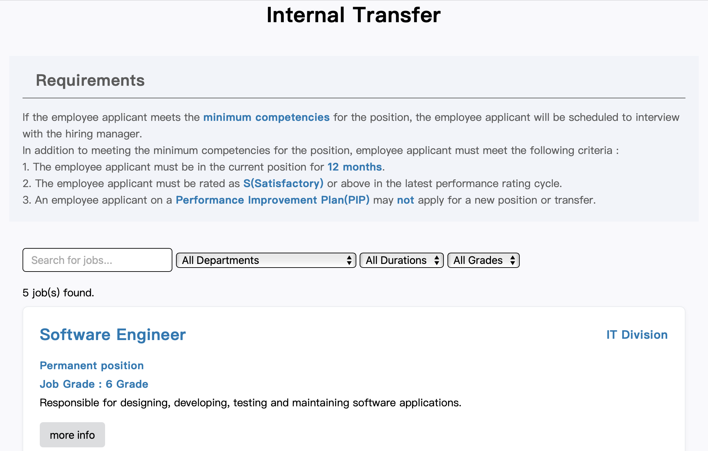

# Internal Transfer Portal

**[→ Live demo](https://silviaiaia.github.io/internal-transfer-portal/)**

A bilingual job board for employees looking to transfer between internal
departments. Built during an internship at a mid-sized electronics
manufacturer to replace an email-and-spreadsheet process for circulating
internal openings.

All job data in this repository is synthetic.

## What it does

- **Bilingual by default** — every posting carries parallel EN / ZH fields; the language toggle swaps the entire UI without a page reload.
- **Data-driven rendering** — job postings are fetched at runtime and rendered client-side, so the listing layout is decoupled from the content. In production the portal reads from the company's internal HR system; this demo swaps in a static `jobs.json` with synthetic postings so the repository runs standalone.
- **Filterable listings** — employees narrow by department, grade and contract type before opening a full description.
- **Application flow** — postings link through to an embedded application form; in the production version this was a Microsoft Form tied to the company's Microsoft 365 tenant.

## Screenshots

<p align="center">
  
</p>

## Running locally

```bash
git clone https://github.com/silviaiaia/internal-transfer-portal.git
cd internal-transfer-portal
python3 -m http.server 8000
```

Then open <http://localhost:8000>. A static server is needed because
`jobs.json` is loaded with `fetch()` — opening `index.html` directly from
the filesystem will fail on CORS.

## Built with

Vanilla HTML, CSS and JavaScript. No framework, no build step.

## License

[MIT](LICENSE).
